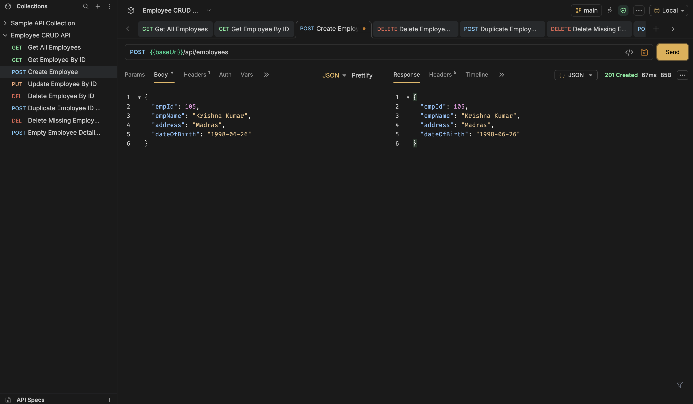
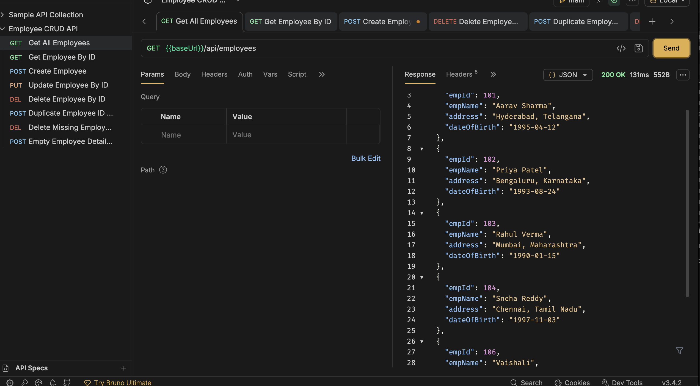
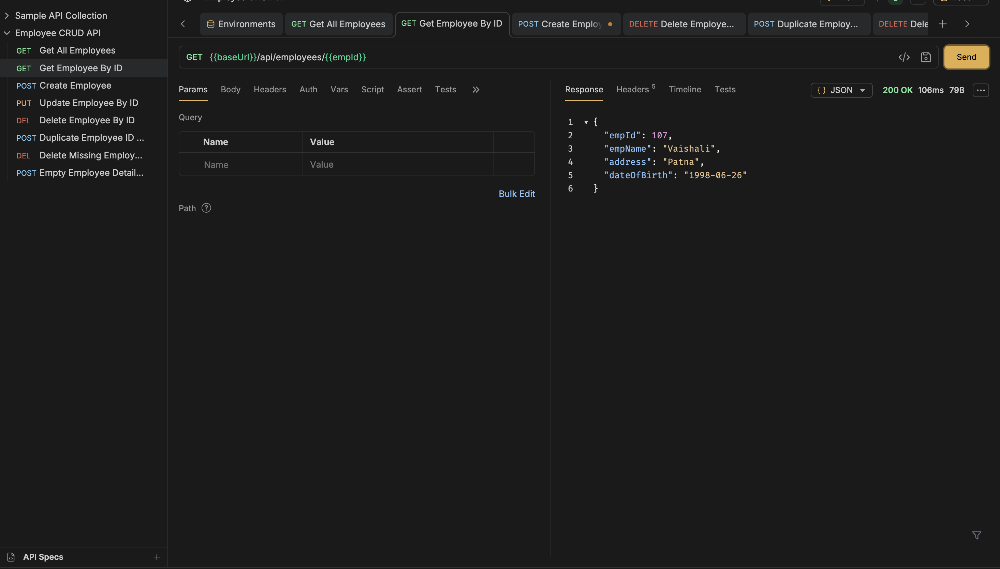
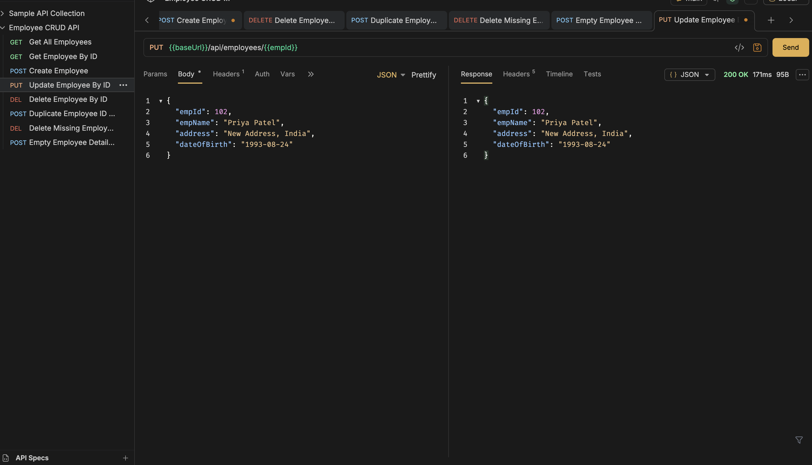
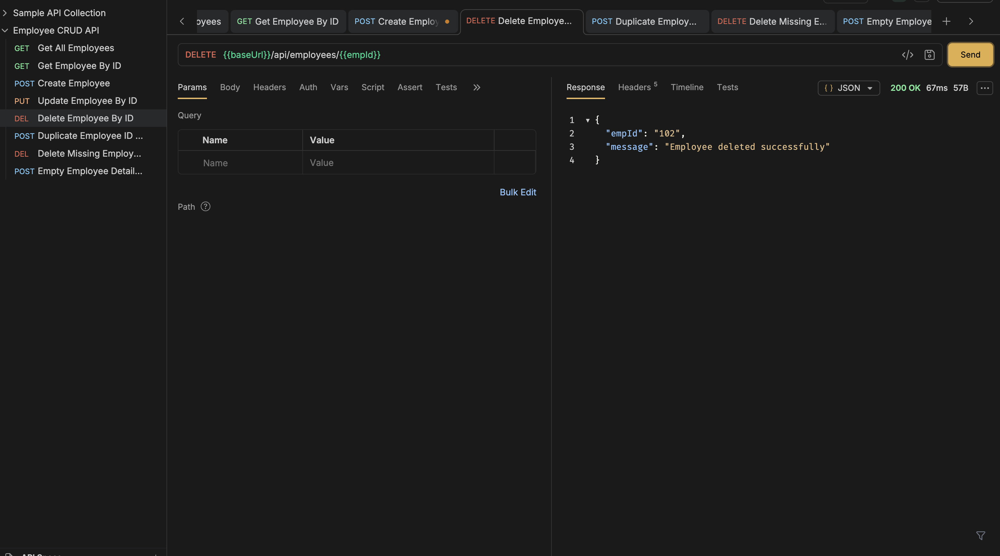
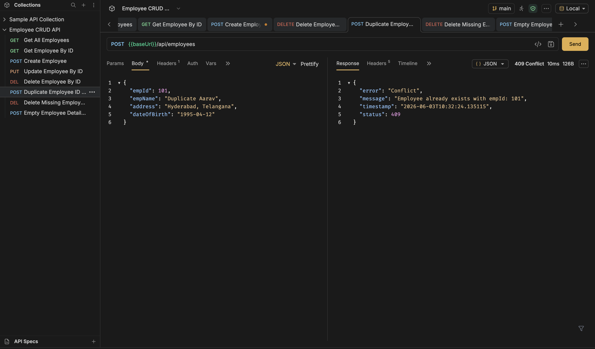
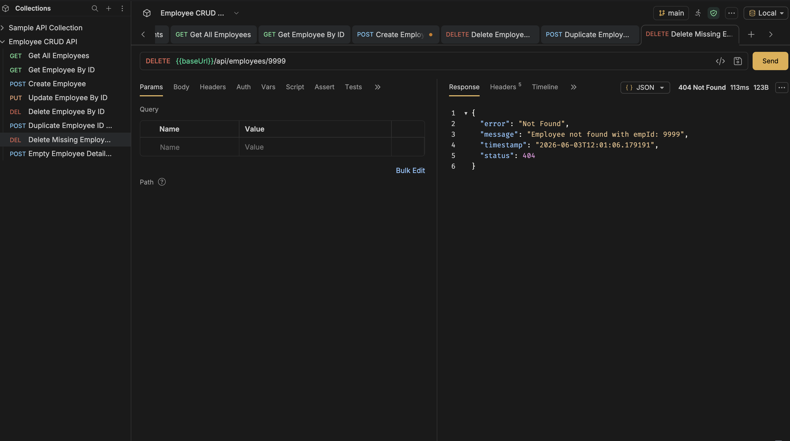
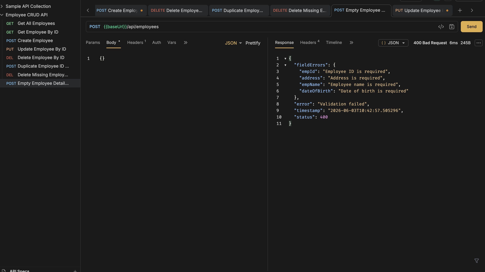
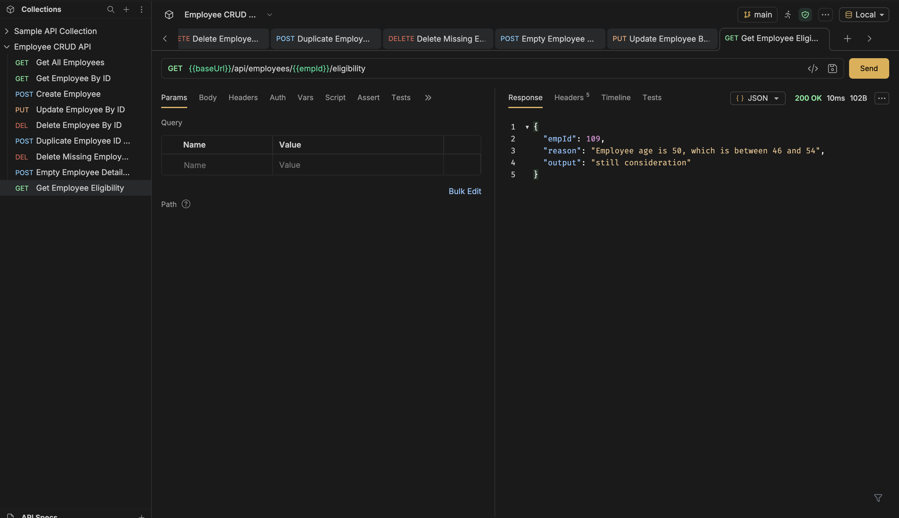

# Employee CRUD API

Spring Boot REST API for employee CRUD operations using MySQL.

## Approach

1. Create a MySQL database named `employee_db`.
2. Create an `employee` table with employee ID, name, address, and date of birth.
3. Insert sample employee records.
4. Build a Spring Boot REST API using Controller, Service, Repository, and Entity layers.
5. Connect Spring Boot to MySQL using Spring Data JPA.
6. Perform CRUD operations using `empId`.
7. Return all responses in JSON format.
8. Test the APIs using Bruno.
9. Push the completed project to GitHub.

## Employee Fields

- `empId`
- `empName`
- `address`
- `dateOfBirth`

## Requirements

- Java 17 or later
- Maven
- MySQL Server

## MySQL Database Setup

Run this script in MySQL:

```sql
SOURCE database/employee_db.sql;
```

Or copy and run the SQL from `database/employee_db.sql`.

Then update your MySQL password in:

```text
src/main/resources/application.properties
```

```properties
spring.datasource.username=root
spring.datasource.password=your_mysql_password
```

## Run The Application

```bash
mvn spring-boot:run
```

The API runs at:

```text
http://localhost:8080
```

## CRUD API Endpoints

### Create Employee

```bash
curl -X POST http://localhost:8080/api/employees \
  -H "Content-Type: application/json" \
  -d '{
    "empId": 105,
    "empName": "Neha Singh",
    "address": "Pune, Maharashtra",
    "dateOfBirth": "1998-06-21"
  }'
```

### Get Employee By ID

```bash
curl http://localhost:8080/api/employees/101
```

### Get All Employees

```bash
curl http://localhost:8080/api/employees
```

### Update Employee By ID

```bash
curl -X PUT http://localhost:8080/api/employees/101 \
  -H "Content-Type: application/json" \
  -d '{
    "empName": "Aarav Sharma",
    "address": "Delhi, India",
    "dateOfBirth": "1995-04-12"
  }'
```

### Delete Employee By ID

```bash
curl -X DELETE http://localhost:8080/api/employees/101
```

### Get Employee Eligibility By ID

```bash
curl http://localhost:8080/api/employees/101/eligibility
```

Eligibility is calculated using the employee date of birth:

```text
Age below 25       -> ineligible
Age 25 to 45       -> eligible
Age 46 to 54       -> still consideration
Age 55 and above   -> ineligible
```

Example JSON response:

```json
{
  "empId": 101,
  "reason": "Employee age is 31, which is between 25 and 45",
  "output": "eligible"
}
```

## Test APIs With Bruno

A Bruno collection is included in:

```text
bruno/employee-crud-api
```

To use it:

1. Open Bruno.
2. Select `Open Collection`.
3. Choose the `bruno/employee-crud-api` folder.
4. Select the `Local` environment.
5. Start the Spring Boot app with `mvn spring-boot:run`.
6. Run the requests.

The collection includes:

- `Get All Employees`
- `Get Employee By ID`
- `Create Employee`
- `Update Employee By ID`
- `Delete Employee By ID`
- `Get Employee Eligibility`
- `Duplicate Employee ID Error`
- `Delete Missing Employee Error`
- `Empty Employee Details Error`

Recommended test flow:

1. Run `Get All Employees`.
   Expected result: `200 OK`.
2. Run `Get Employee By ID`.
   Expected result: `200 OK`.
3. Run `Create Employee`.
   Expected result: `201 Created`.
4. Run `Update Employee By ID`.
   Expected result: `200 OK`.
5. Run `Delete Employee By ID`.
   Expected result: `200 OK`.
6. Run `Get Employee Eligibility`.
   Expected result: `200 OK`.
7. Run `Duplicate Employee ID Error`.
   Expected result: `409 Conflict` because the employee ID already exists.
8. Run `Delete Missing Employee Error`.
   Expected result: `404 Not Found` because employee `9999` does not exist.
9. Run `Empty Employee Details Error`.
   Expected result: `400 Bad Request` with validation errors.

## Bruno Test Screenshots

Add Bruno screenshots in the `docs/screenshots` folder using these file names:

```text
docs/screenshots/01-create-employee.png
docs/screenshots/02-get-all-employees.png
docs/screenshots/03-get-employee-by-id.png
docs/screenshots/04-update-employee.png
docs/screenshots/05-delete-employee.png
docs/screenshots/06-duplicate-id-error.png
docs/screenshots/07-delete-missing-id-error.png
docs/screenshots/08-empty-employee-error.png
docs/screenshots/09-get-employee-eligibility.png
```

### 1. Create Employee

Expected result: `201 Created`



### 2. Get All Employees

Expected result: `200 OK`



### 3. Get Employee By ID

Expected result: `200 OK`



### 4. Update Employee By ID

Expected result: `200 OK`



### 5. Delete Employee By ID

Expected result: `200 OK`



### 6. Duplicate ID Creation Error

Expected result: `409 Conflict`



### 7. Delete ID Which Does Not Exist

Expected result: `404 Not Found`



### 8. Empty Employee Details Creation

Expected result: `400 Bad Request`



### 9. Get Employee Eligibility

Expected result: `200 OK`



## Example JSON Output

```json
{
  "empId": 101,
  "empName": "Aarav Sharma",
  "address": "Hyderabad, Telangana",
  "dateOfBirth": "1995-04-12"
}
```

## Create GitHub Repository

Initialize Git locally:

```bash
git init
git add .
git commit -m "Create employee CRUD Spring Boot API"
```

Create a new empty repository on GitHub, then connect and push:

```bash
git branch -M main
git remote add origin https://github.com/YOUR_USERNAME/employee-crud-api.git
git push -u origin main
```
